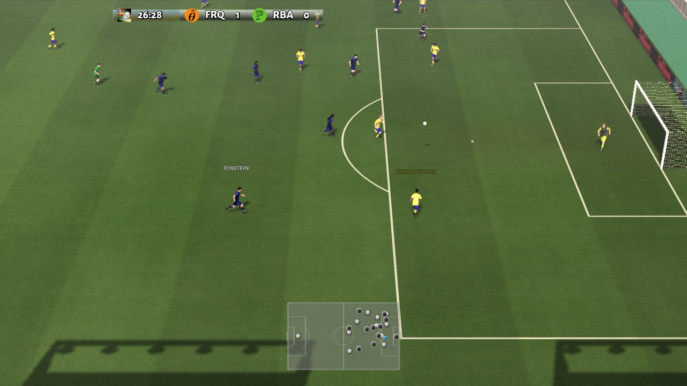

# TiKick

<div align="center">

</div>

[](https://opensource.org/licenses/Apache-2.0)

### 1.Introduction

Learning-based agent for Google Research Football

Code accompanying the paper 
"TiKick: Towards Playing Multi-agent Football Full Games from Single-agent Demonstrations". [[arxiv](https://arxiv.org/abs/2110.04507)][[videos](https://sites.google.com/view/tikick)]. The implementation in this repositorory is heavily based on https://github.com/marlbenchmark/on-policy.

Update:
- [22.8.11]: 11 vs 11 model is released! Model can be found on [Google Drive](https://drive.google.com/drive/folders/1pUW_7db9Of9zCDZZWoImVgg0_lX5xCt1?usp=sharing).

### 2.Installation
```
pip install -r requirements.txt
pip install .
```

### 3.Evaluation with Trained Model

(a) First, you should download the trained model from Baidu Yun or Google Drive:

* pre-trained models can be found at:
    * Baidu Yun: [Click to download](https://pan.baidu.com/s/11bKsKxs_spXzlpRGCUNlOA)  Password：vz3a
    * Google Drive: [Click to download](https://drive.google.com/drive/folders/1pUW_7db9Of9zCDZZWoImVgg0_lX5xCt1?usp=sharing)

(b) Then, you should put the `actor.pt` under `./models/{scenario_name}/`.

(c) Finally, you can go to the `./scripts/football` folder and execute the evaluation script as below:

```
cd scripts/football
./evaluate.sh
```

Then the replay file will be saved into `./results/{scenario_name}/replay/`.

* Hyper-parameters in the evaluation script:
    * --replay_save_dir : the replay file will be saved in this directory
    * --model_dir : pre-trained model should be placed under this directory
    * --n_eval_rollout_threads : number of parallel envs for evaluating rollout
    * --eval_num : number of total evaluation times
    
### 4.Render with the Replay File

Once you obtain a replay file, you can convert it to a `.avi` file and watch the game. 
This can be easily done via:

```
cd scripts/football
python3 replay2video.py --replay_file ../../results/academy_3_vs_1_with_keeper/replay/your_path.dump
```

The video file will finally be saved to `./results/{scenario_name}/video/`

### 5.Cite

Please cite our paper if you use our codes or our weights in your own work:

```
@misc{huang2021tikick,
    title={TiKick: Towards Playing Multi-agent Football Full Games from Single-agent Demonstrations},
    author={Shiyu Huang and Wenze Chen and Longfei Zhang and Ziyang Li and Fengming Zhu and Deheng Ye and Ting Chen and Jun Zhu},
    year={2021},
    eprint={2110.04507},
    archivePrefix={arXiv},
    primaryClass={cs.AI}
}
```
